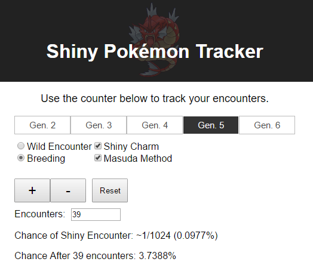

# Shiny Pokémon Tracker



This small web app tracks the odds of finding shiny Pokémon using different hunting strategies in each offical Pokémon game.  A live version can be found [here](http://www.huderlem.com/shinytracker/).

This project was bootstrapped with [Create React App](https://github.com/facebookincubator/create-react-app).

## Getting Started

These instructions will get you a copy of the project working on your local machine for development.

### Prerequisites

You must have [npm](https://www.npmjs.com/) installed, since this is used to manage and install the required JavaScript packages.

### Installing

First clone the repository and install package dependencies with npm:

```
git clone https://github.com/huderlem/shiny-pokemon-tracker.git
cd shiny-pokemon-tracker
npm install
```

## Developing
After installing the project, you can run the web app on your local machine. The following command will run the app at http://localhost:3000/:
```
npm start
```

All source code lives in the `src` directory. This project makes heavy use of [React](https://facebook.github.io/react/) to drive the user interface.

## Deploying

To deploy the app, you will first need to build the app, which will perform optimizations and bundle everything into a few compact files.

```
npm run build
```

This will place the output into the `build` directory. From there, you can copy the `build` directory to the root of your webserver.  If you wish to deploy the app to a location on the webserver that isn't the root, you need to add the following line to `package.json`:
```
"homepage": "http://www.mywebsite.com/desired/path/to/app"
```

See [Create React App's README](https://github.com/facebookincubator/create-react-app) for more information.
